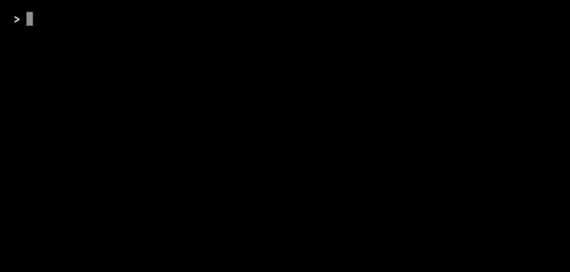

# web-archive.txt

## Overview

*web-archive.txt* is an open specification for web archive interoperability, defining a human- and machine-readable plain-text descriptor published via the Well-Known URI pattern ([RFC8615](https://rfc-editor.org/info/rfc8615)). It provides a consistent way for web archives to publish identity, scope and access interfaces while enabling discovery and verification of programmatic endpoints.

## Why *web-archive.txt*?

Web archives exist as a constellation of “[siloed nodes](http://dlib.org/dlib/november15/vandesompel/11vandesompel.html)”, with identity, scope, governance, and access often opaque or reliant on ad hoc knowledge. As systems evolve, aggregators and web archive registries can degrade, concentrating visibility in a few web archives. Our proposal, *web-archive.txt*, provides a decentralised way for each web archive to publish a standard, human- and machine-readable descriptor, making the web archiving landscape more findable, accessible, interoperable, and reusable ([FAIR](https://go-fair.org/fair-principles)).

## *web-archive.txt* Specification

> [!NOTE]
> **[→ *web-archive.txt* Specification v0.1⁠](/specification/v0.1/specification.md)**

*web-archive.txt* descriptors are written in [TOML](https://toml.io), prioritising human readability while remaining fully machine-parseable. Native support for comments allows web archives to include additional implementation context without affecting interoperability.

### Example *web-archive.txt*

The following is a complete *web-archive.txt* descriptor for the [UK Government Web Archive (UKGWA)⁠](https://nationalarchives.gov.uk/webarchive) ([available here](/registry/ukgwa/web-archive.txt)):

```toml
version = "0.1"
last_updated = "2026-08-17"

[archive]
id = "ukgwa"
name = [ "UK Government Web Archive", { alt = "UKGWA" } ]
established = "2003"
website = "https://nationalarchives.gov.uk/webarchive"
email = "webarchive@nationalarchives.gov.uk"

[archive.organisation]
name = [ "The National Archives", { alt = "TNA" } ]
type = "national_archive"
location = [ "GB" ]
website = "https://nationalarchives.gov.uk"

[archive.scope]
crawl = [ "selective", "event", "thematic" ]
authority = { type = "public_record", documentation = "https://legislation.gov.uk/ukpga/Eliz2/6-7/51/contents" } # Public Records Act 1958 (6 & 7 Eliz. 2 c. 51)
coverage = "1996-01-01/.." # Began capturing in 2003; backfilled coverage to 1996 by the Internet Archive
domains = [ ".gov.uk" ]

[api]
rate_limit = false # IP address whitelisting can be requested for high-volume access

[api.memento]
timemap = { endpoint = "https://webarchive.nationalarchives.gov.uk/ukgwa/timemap/json/{url}", access = "online" }
timegate = { endpoint = "https://webarchive.nationalarchives.gov.uk/ukgwa/{datetime}/{url}", access = "online" }

[api.cdx]
query = { endpoint = "https://webarchive.nationalarchives.gov.uk/ukgwa/cdx?url={url}", access = "online" }

[replay]
rewritten = "https://webarchive.nationalarchives.gov.uk/ukgwa/{datetime}/{url}"
no_toolbar = "https://webarchive.nationalarchives.gov.uk/ukgwa/nobanner/{datetime}/{url}"
raw = "https://webarchive.nationalarchives.gov.uk/ukgwa/{datetime}id_/{url}"
```

## Publishing a *web-archive.txt*

A conforming web archive **SHOULD** publish its descriptor in accordance with [RFC8615](https://rfc-editor.org/info/rfc8615), Well-Known URIs.

```text
/.well-known/web-archive.txt
```

Web archives **MAY** additionally advertise the descriptor using an HTTP `Link` header:

```http
Link: </.well-known/web-archive.txt>; rel="service-desc"
```

## Validating a *web-archive.txt*

A specification validator is provided to verify conformance of a *web-archive.txt* descriptor with the schema. It validates TOML structure, applies versioned schema rules, reports errors with location information, and can verify declared API endpoints.



### Installation

   1. Clone the repository:

      ```bash
      git clone https://github.com/overbrowsing/web-archive.txt.git
      cd web-archive.txt
      ```

### Usage

   1. Validate a target *web-archive.txt*:

      ```bash
      # macOS / Linux
      ./validate path/to/web-archive.txt

      # Windows
      node bin/validator.js path/to/web-archive.txt
      ```

   2. Validate a target *web-archive.txt* against a version of the specification (e.g. v0.1):

      ```bash
      # macOS / Linux
      ./validate path/to/web-archive.txt --0.1

      # Windows
      node bin/validator.js path/to/web-archive.txt --0.1
      ```

## Registry

This repository maintains a bootstrap registry of *web-archive.txt* descriptors for web archives, including [IIPC member web archives](https://netpreserve.org/about-us/members/) and other organisations. Compiled from public information used to develop the specification, the registry is maintained in [`/registry`](/registry).

To be listed or update your information, publish a *web-archive.txt* descriptor at `/.well-known/web-archive.txt` on your domain, then submit a [pull request](https://github.com/overbrowsing/web-archive.txt/pulls).

| Web Archive                                                                                                     | Organisation                                                                                    | Type               | ID     | IIPC Member |
|-----------------------------------------------------------------------------------------------------------------|-------------------------------------------------------------------------------------------------|--------------------|--------|:-----------:|
| 🏴 [archive.today (archive.ph)](registry/at/web-archive.txt)                                                     | Unknown                                                                                         | Commercial         | at     |             |
| 🇵🇹 [Arquivo.pt](registry/arq/web-archive.txt)                                                                    | Foundation for National Scientific Computing / Foundation for Science and Technology (FCCN/FCT) | Research Institute | arq    | ✓           |
| 🇦🇺 [Australian Web Archive](registry/awa/web-archive.txt)                                                        | National Library of Australia                                                                   | National Library   | awa    | ✓           |
| 🇨🇦 [BAnQ Web Archiving](registry/banq/web-archive.txt)                                                           | Bibliothèque et Archives nationales du Québec                                                   | State Library      | banq   | ✓           |
| 🇪🇬 [BibAlex](registry/ba/web-archive.txt)                                                                        | Bibliotheca Alexandrina                                                                         | National Library   | ba     | ✓           |
| 🇫🇷 [BnF Web Archives (BnF)](registry/bnf/web-archive.txt)                                                        | Bibliothèque nationale de France                                                                | National Library   | bnf    | ✓           |
| 🇺🇸 [California Digital Library Web Archiving Service (WAS)](registry/cdlwa/web-archive.txt)                      | California Digital Library                                                                      | University         | cdlwa  | ✓           |
| 🇨🇱 [Chilean Web Archive (Archivo de la Web Chilena)](registry/cwa/web-archive.txt)                               | National Library of Chile                                                                       | National Library   | cwa    | ✓           |
| 🇺🇸 [Columbia University Libraries Web Archives](registry/culwa/web-archive.txt)                                  | Columbia University Libraries                                                                   | University         | culwa  | ✓           |
| 🇺🇸 [Common Crawl](registry/cc/web-archive.txt)                                                                   | Common Crawl Foundation                                                                         | Nonprofit          | cc     | ✓           |
| 🇺🇸 [Congressional & Federal Web Harvests (NARA Web Harvests)](registry/nara/web-archive.txt)                     | National Archives and Records Administration                                                    | National Archive   | nara   |             |
| 🇭🇷 [Croatian Web Archive (HAW)](registry/haw/web-archive.txt)                                                    | National and University Library in Zagreb                                                       | National Library   | haw    | ✓           |
| 🇨🇿 [Czech web archive (Webarchiv)](registry/webcz/web-archive.txt)                                               | National Library of the Czech Republic                                                          | National Library   | webcz  | ✓           |
| 🇩🇰 [Danish Web Archive (Netarkivet)](registry/kbdk/web-archive.txt)                                              | Royal Danish Library                                                                            | National Library   | kbdk   | ✓           |
| 🇸🇰 [Digital Resources – Web Harvesting and E-Born Content Archiving (DIP)](registry/slo/web-archive.txt)         | University Library in Bratislava                                                                | State Library      | slo    | ✓           |
| 🇪🇪 [Estonian Web Archive (Eesti Veebiarhiiv)](registry/ewa/web-archive.txt)                                      | National Library of Estonia                                                                     | National Library   | ewa    | ✓           |
| 🇪🇺 [European Union Web Archive](registry/euwa/web-archive.txt)                                                   | European Union                                                                                  | Government         | euwa   | ✓           |
| 🇺🇸 [Federal Depository Library Program Web Archive (FDLP Web Archive)](registry/fdlpwa/web-archive.txt)          | United States Government Publishing Office                                                      | Government         | fdlpwa | ✓           |
| 🇫🇮 [Finnish Web Archive (Suomalainen verkkoarkisto)](registry/fwa/web-archive.txt)                               | National Library of Finland                                                                     | National Library   | fwa    | ✓           |
| 🇩🇪 [German National Library Web Archive (DNB Webarchiv)](registry/dnb/web-archive.txt)                           | German National Library                                                                         | National Library   | dnb    | ✓           |
| 🇨🇦 [Government of Canada Web Archive (Archives du Web du gouvernement du Canada)](registry/gcwa/web-archive.txt) | Library and Archives Canada                                                                     | National Library   | gcwa   | ✓           |
| 🇬🇷 [Greek Web Archive (Αρχείο Ελληνικού Ιστού)](registry/nlg/web-archive.txt)                                    | National Library of Greece                                                                      | National Library   | nlg    | ✓           |
| 🇺🇸 [Harvard Library Web Archiving Collection Service (WAX)](registry/wax/web-archive.txt)                        | Harvard Library                                                                                 | University         | wax    | ✓           |
| 🇮🇸 [Icelandic Web Archive (Vefsafn.is)](registry/iwa/web-archive.txt)                                            | National and University Library of Iceland                                                      | National Library   | iwa    | ✓           |
| 🇫🇷 [INAthèque Web Archive (INAthèque L'archive du web)](registry/ina/web-archive.txt)                            | National Audiovisual Institute                                                                  | Government         | ina    | ✓           |
| 🇺🇸 [Internet Archive (Wayback Machine)](registry/ia/web-archive.txt)                                             | Internet Archive                                                                                | Nonprofit          | ia     | ✓           |
| 🇮🇱 [Israeli Internet Archive (הארכיון האינטרנטי הישראלי)](registry/iia/web-archive.txt)                          | The National Library of Israel                                                                  | National Library   | iia    | ✓           |
| 🇳🇱 [KB Web Collection (Webcollectie)](registry/kbnl/web-archive.txt)                                             | National Library of the Netherlands                                                             | National Library   | kbnl   | ✓           |
| 🇱🇻 [Latvian Web Archive (Latvijas tīmekļa vietņu arhīvs)](registry/lnb/web-archive.txt)                          | National Library of Latvia                                                                      | National Library   | lnb    | ✓           |
| 🇺🇸 [Library of Congress Web Archive](registry/loc/web-archive.txt)                                               | Library of Congress                                                                             | National Library   | loc    | ✓           |
| 🇱🇺 [Luxembourg Web Archive (Archives du web luxembourgeois)](registry/bnl/web-archive.txt)                       | National Library of Luxembourg                                                                  | National Library   | bnl    | ✓           |
| 🇮🇪 [National Library of Ireland Web Archive (NLI Web Archive)](registry/nliwa/web-archive.txt)                   | National Library of Ireland                                                                     | National Library   | nliwa  | ✓           |
| 🇺🇸 [National Library of Medicine](registry/nlm/web-archive.txt)                                                  | National Institutes of Health                                                                   | National Library   | nlm    | ✓           |
| 🇷🇸 [National Library of Serbia (Народна библиотека Србије)](registry/nbs/web-archive.txt)                        | National Library of Serbia                                                                      | National Library   | nbs    | ✓           |
| 🏴󠁧󠁢󠁳󠁣󠁴󠁿 [National Records of Scotland Web Archive](registry/nrs/web-archive.txt)                                      | National Records of Scotland                                                                    | State Archive      | nrs    |             |
| 🇭🇺 [National Széchényi Library Web Archive (MNMKK OSZK Webarchívum)](registry/oszk/web-archive.txt)              | National Széchényi Library                                                                      | National Library   | oszk   | ✓           |
| 🇳🇱 [Netherlands Institute for Sound and Vision (Beeld en Geluid)](registry/nisv/web-archive.txt)                 | Netherlands Institute for Sound and Vision                                                      | Nonprofit          | nisv   | ✓           |
| 🇳🇿 [New Zealand Web Archive](registry/nzwa/web-archive.txt)                                                      | National Library of New Zealand                                                                 | National Library   | nzwa   | ✓           |
| 🇳🇴 [Norwegian Web Archive (Nettarkivet)](registry/nwa/web-archive.txt)                                           | National Library of Norway                                                                      | National Library   | nwa    | ✓           |
| 🇸🇮 [NUK Web Archive (Spletni Arhiv NUK)](registry/nuk/web-archive.txt)                                           | National and University Library of Slovenia                                                     | National Library   | nuk    | ✓           |
| 🇰🇷 [Online Archiving & Searching Internet Sources (OASIS)](registry/oasis/web-archive.txt)                       | National Library of Korea                                                                       | National Library   | oasis  | ✓           |
| 🇵🇱 [Polish State Archives (NDAP)](registry/ndap/web-archive.txt)                                                 | Polish State Archives                                                                           | National Archive   | ndap   | ✓           |
| 🇬🇧 [PRONI Web Archive](registry/proni/web-archive.txt)                                                           | The Public Record Office of Northern Ireland                                                    | State Archive      | proni  | ✓           |
| 🇧🇪 [Royal Library of Belgium Web Archive (BelgicaWeb)](registry/kbr/web-archive.txt)                             | Royal Library of Belgium                                                                        | National Library   | kbr    | ✓           |
| 🇺🇸 [Smithsonian Institution Archives](registry/sia/web-archive.txt)                                              | Smithsonian Libraries and Archives                                                              | Research Institute | sia    | ✓           |
| 🇪🇸 [Spanish Web Archive (Archivo de la Web Española)](registry/swa/web-archive.txt)                              | National Library of Spain                                                                       | National Library   | swa    | ✓           |
| 🇺🇸 [Stanford Web Archive Portal (SWAP)](registry/swap/web-archive.txt)                                           | Stanford University Libraries                                                                   | University         | swap   | ✓           |
| 🇬🇧 [UK Government Web Archive (UKGWA)](registry/ukgwa/web-archive.txt)                                           | The National Archives                                                                           | National Archive   | ukgwa  | ✓           |
| 🇬🇧 [UK Web Archive (UKWA)](registry/ukwa/web-archive.txt)                                                        | UK Legal Deposit Libraries                                                                      | National Library   | ukwa   | ✓           |
| 🏴󠁧󠁢󠁳󠁣󠁴󠁿 [The University of Edinburgh, Heritage Collections](registry/uoe/web-archive.txt)                             | The University of Edinburgh                                                                     | University         | uoe    |             |
| 🇺🇸 [UNT Web Archives (UNTWA)](registry/untweb/web-archive.txt)                                                   | University of North Texas Libraries                                                             | University         | untweb | ✓           |
| 🇸🇪 [The Web Archive of the National Library of Sweden (Kulturarw3)](registry/kbse/web-archive.txt)               | National Library of Sweden                                                                      | National Library   | kbse   | ✓           |
| 🇪🇸 [The Web Archive of Catalonia (PADICAT)](registry/cat/web-archive.txt)                                        | Library of Catalonia                                                                            | State Library      | cat    | ✓           |
| 🇸🇬 [Web Archive Singapore (WebArchiveSG)](registry/wasg/web-archive.txt)                                         | National Library Board                                                                          | National Library   | wasg   | ✓           |
| 🇨🇭 [Web Archive Switzerland (Webarchiv Schweiz)](registry/nbch/web-archive.txt)                                  | Swiss National Library                                                                          | National Library   | nbch   | ✓           |
| 🇯🇵 [Web Archiving Project (WARP)](registry/warp/web-archive.txt)                                                 | National Diet Library, Japan                                                                    | National Library   | warp   | ✓           |
| 🇨🇳 [Web Information Collection and Preservation (网络信息采集与保存)](registry/nlc/web-archive.txt)                 | National Library of China                                                                       | National Library   | nlc    | ✓           |
| 🇦🇹 [Webarchive Austria (Webarchiv Österreich)](registry/onb/web-archive.txt)                                     | Austrian National Library                                                                       | National Library   | onb    | ✓           |
| 🇨🇦 [York University Digital Library (YUDL)](registry/yudl/web-archive.txt)                                       | York University Libraries                                                                       | University         | yudl   | ✓           |

### Using the Registry

This registry **MAY** be used as an interim aggregator via the [GitHub Contents API](https://docs.github.com/en/rest/repos/contents/). The examples below show how:

   1. Fetch a *web-archive.txt* descriptor from the registry (e.g. Internet Archive):

      ```bash
      # Replace 'ia' (Internet Archive) with any web archive ID from the registry above

      curl -sL https://raw.githubusercontent.com/overbrowsing/web-archive.txt/main/registry/ia/web-archive.txt
      ```

   2. Fetch every *web-archive.txt* descriptor from the registry:

      ```bash
      for ARCHIVE in $(curl -sL https://api.github.com/repos/overbrowsing/web-archive.txt/contents/registry/ | grep -o '"name": "[^"]*"' | cut -d'"' -f4); do
        curl -sL "https://raw.githubusercontent.com/overbrowsing/web-archive.txt/main/registry/$ARCHIVE/web-archive.txt"
      done
      ```

   3. Check which web archives with a CDX server API have archived a URL:

      ```bash
      URL="https://example.com"

      for ARCHIVE in $(curl -sL https://api.github.com/repos/overbrowsing/web-archive.txt/contents/registry/ | grep -o '"name": "[^"]*"' | cut -d'"' -f4); do
        DESCRIPTOR=$(curl -sL "https://raw.githubusercontent.com/overbrowsing/web-archive.txt/main/registry/$ARCHIVE/web-archive.txt")
        ENDPOINT=$(echo "$DESCRIPTOR" | awk '/^\[api\.cdx\]/{f=1; next} /^\[/{f=0} f' | grep -o 'endpoint = "[^"]*"' | head -1 | cut -d'"' -f2)
        [ -z "$ENDPOINT" ] && continue
        NAME_LINE=$(echo "$DESCRIPTOR" | grep -m1 '^name =')
        EN=$(echo "$NAME_LINE" | grep -o 'en = "[^"]*"' | cut -d'"' -f2)
        NAME=${EN:-$(echo "$NAME_LINE" | grep -o '"[^"]*"' | head -1 | tr -d '"')}
        curl -sL "${ENDPOINT/\{url\}/$URL}" | grep -q . && echo "$NAME"
      done
      ```

## Credits

Developed by [Overbrowsing](https://overbrowsing.com) at the [Institute for Design Informatics, The University of Edinburgh](https://designinformatics.org).

## Citing

If you use, implement, or reference this project, please cite it as '*web-archive.txt*' and include clear attribution in publications, software, or documentation where appropriate.

## Licenses

*web-archive.txt* is licensed under [Apache 2.0](https://tldrlegal.com/license/apache-license-2-0-apache-2-0). For full licensing details, see the [LICENSE](/LICENSE) file.